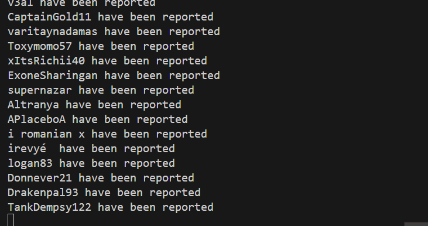

# LoL_LCU_History_report
script that report everyone you play with exept your friend &amp; yourself

how to use:

install requirements:
pip install -r requirements.txt

run the script:
python report_history.py

how the script work:
it will connect to the LCU API, find all the game you played
get the game id, the player of the game username, summonerId, puuid.
it will get your friendlist and save the player name of it
If the player is in your friend list, it will not report.
otherwise, the report is send.

